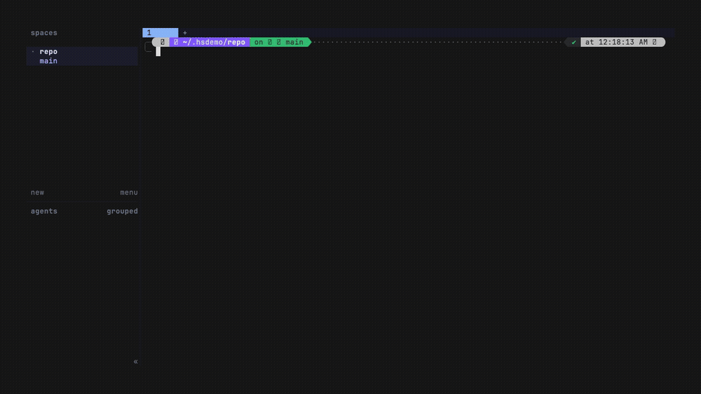

# herdr-swarm

Parallel coding agents on one repo, safely, inside [Herdr](https://herdr.dev).
One action fans out N agents — each into its own git worktree on a run-unique
branch forked from a recorded base SHA — a status pane shows what each agent
actually *changes* (committed and uncommitted counts, not just terminal
output), and a review-first harvest pane merges the work back to base one slot
at a time. Agents commit locally and never push; the orchestrator merges.



**Docs:** the [StructuPath Herdr Suite guide](https://herdr.structupath.ai/docs/swarm/)
is the practical guide to this plugin and its three siblings (Browser, Guard,
Conductor).

## The workflow (0.5.0)

Running N agents only pays off if you can pick the best result. From fan-out
to a landed winner:

| Step | What happens | Section |
| --- | --- | --- |
| **Fan out** | One task, or a different task per slot, into N worktrees. Each slot gets its dependencies (copy-on-write `node_modules`), its own ports, and its slot variables. Swarm warns up front when two slots' tasks name the same files | [Scripting fan-out](#scripting-fan-out), [Fresh worktrees](#fresh-worktrees-lack-your-env) |
| **Steer** | `broadcast` one message to every running agent | [Steering](#steering-a-running-swarm) |
| **Know when done** | The status pane records each slot finished (its marker, or its agent exiting), shows elapsed time, and notifies once when all are done | [Finish detection](#finish-detection) |
| **Check** | `validate.sh` runs on each slot's exact commit, automatically on finish if you opt in | [Validating slots](#validating-slots) |
| **Compare** | A ranked table (checks, commits, files, overlap, time) and a diff of any two slots | [Comparing slots](#comparing-slots-and-picking-a-winner) |
| **Land** | Merge the winner at the exact commit you compared; finished losers are skipped and archived, and branches are kept | [Comparing slots](#comparing-slots-and-picking-a-winner) |
| **Resolve** | A conflicting merge can go to a resolver agent. You review the resolution (including any change outside the conflicts) before it lands | [Resolving conflicts](#resolving-conflicts) |

Nothing merges without your explicit selection or confirmation. The merge
guarantees are unchanged: drift-checked, compare-and-swap, journaled, and
review-first.

## Requirements

- **herdr 0.7.4 or newer.** Fan-out works on both 0.7.4 and 0.7.5+, by two
  different routes, because 0.7.5 replaced `agent start --cwd/--workspace`
  with a pane-targeting form whose `--kind` is a closed whitelist with no
  arbitrary-argv member:
  - On **0.7.4**, `agent start --cwd` builds each slot and herdr detects the
    agent natively, so slot state in the status pane is herdr's own.
  - On **0.7.5+**, the plugin builds each slot itself — `pane split` into the
    worktree, `pane run` for the slot's argv, `pane report-agent` to register
    it — so slots run *any* command, but their state is **plugin-reported**:
    `working` when the slot starts. Because the plugin holds that state,
    Herdr stops reading the screen, so nothing else ever flips it. Finish
    detection (below) does that while the status pane is open, and so does a
    harvest preview. Committed work is mergeable regardless. Archive
    separately requires a settled agent (`idle`, `done`, or absent) before
    removing its worktree; harvest refreshes the completed slot's reported
    state before auto-archive.
  - On **0.7.5+**, `pane run` hands the slot's argv to the pane's **shell**,
    not to `exec` — a preset containing shell metacharacters is interpreted
    there, unlike on 0.7.4. Presets are your own config, but keep them to a
    plain command and its flags.

  Harvest, abort, and prune of an existing run work on every supported
  version (they are mostly git). Versions above the newest tested get a
  warning, never a refusal.

  Two 0.5.0 features need the 0.7.5+ pane-built path: the **conflict
  resolver** (refused on 0.7.4) and **slot variables inside the agent
  process** (on 0.7.4 the agent learns its ports from the task file instead).
  The whole 0.5.0 flow was exercised live on Herdr 0.8.2; see
  [readiness](docs/readiness.md).
- **git >= 2.38** recommended (relies on `git worktree`, three-arg
  `git update-ref` compare-and-swap, and `git merge-base --is-ancestor`).
- **Node.js >= 20** on your PATH (manifest handling, manifest validation, and
  pane renderers). No Python runtime or third-party parser is required.
- macOS or Linux.

## Install

```sh
herdr plugin install StructuPath/herdr-swarm
```

For development:

```sh
git clone https://github.com/StructuPath/herdr-swarm
herdr plugin link ./herdr-swarm
npm test
```

Check the installation before starting agents with `npm run doctor`. It probes
Node, Git, and the selected Herdr binary without opening a session or writing
plugin state. If multiple Herdr installations are present, use
`HERDR_BIN_PATH=/absolute/path/to/herdr npm run doctor` and pass that same
override to plugin scripts. A successful version check is not a live workflow
test; newer-than-tested versions still warn. Confirm that the selected preset's
agent command is installed and authenticated separately.

Maintainers can run `npm run validate` for manifest/version checks, syntax checks
of **every** shell script and Node module, ShellCheck, and the real-git test
suite. ShellCheck must be installed separately. `npm run build` runs just the
manifest and syntax checks; this interpreted plugin has no compiled output or
npm dependencies.

See [readiness and live workflow evidence](docs/readiness.md) for the tested
scope and prioritized follow-up work.

## Quick start

The plugin ships five actions (Herdr plugins cannot ship default keybindings —
add your own, see below):

1. **Fan out** (`structupath.swarm.fanout`) — opens the fan-out pane, which
   prompts for: leftover-detritus handling if a previous run left `swarm/*`
   branches (delete / rename to `swarm-kept/` / quit), slot count N (soft cap
   6, raise with `HERDR_SWARM_MAX_SLOTS`), a preset per slot, a shared task
   prompt (finish with a single `.` on its own line), and optional per-slot
   task overrides. It then creates one worktree + branch
   (`swarm/<run-id>/<slot>`) per slot, writes the task to `.swarm-task.md` in
   each worktree (kept out of `git status` via the repo's `info/exclude`),
   starts the agents, and opens the status pane.
2. **Status** (`structupath.swarm.status`) — per-slot agent state (`blocked`
   rendered loud), branch, and committed/uncommitted change counts measured
   against the recorded fork SHA, never the moving base tip. Keys: `1`–`9`
   jump to that slot's agent, `q` closes the pane. Survives a Herdr restart;
   unreachable agents show as `unknown` with their committed work still
   harvestable.
3. **Harvest** (`structupath.swarm.harvest`) — review-first merge-back. Keys:
   `1`–`9` select a slot, `w` opens the compare view (diff two slots, merge a
   winner), `v` validates a slot, `r` re-previews, `q` quits. Per slot:
   - *Clean slot* — merged `--no-ff` with a templated message. The base ref is
     drift-checked before **every** merge; if it moved, all slots re-preview.
     When base is not checked out anywhere, the merge runs in a plugin-owned
     detached worktree and the base ref advances by atomic compare-and-swap.
     When base *is* your checked-out branch, you get an explicit confirm and
     the merge runs in your tree only after a clean-tree re-check.
   - *Dirty slot* — prompt: `w` commit as WIP, `s` skip, `d` discard (typed
     branch-name confirmation; a snapshot ref is written first).
   - *Conflict or hook failure* — classified distinctly; `s` shells into the
     merge tree, `a` aborts the merge (`git merge --abort`), `b` backs out.
     For a conflict, `g` hands it to a resolver agent and `c` concludes a
     merge you or the resolver committed. See "Resolving conflicts" below.
   - *Publish (PR-based harvest)* — `p` then a slot digit pushes that slot's
     branch to a remote (default `origin`, override with
     `HERDR_SWARM_PUBLISH_REMOTE`) instead of merging locally — plain push,
     never `--force`; a non-fast-forward rejection is surfaced, not overridden.
     Open the pull request on your forge as usual; once its merge lands and
     base updates, the next re-preview auto-detects it (ancestry for merge
     commits, tree containment for squashes) and the slot proceeds to archive.
     Scriptable as `harvest-step.sh publish <slot>`.
     For the optional GitHub draft handoff, use `g` then a slot digit or
     `publish-pr <slot>`; `c` then a digit reads its current CI status.
   - *Archive* — after merge/skip, the worktree is removed (branch kept).
     Recursive ignored-file inventory is byte-safe and requires the exact
     digest-bound, one-use approval before ignored data can be removed. The
     same guard covers plugin-owned detached merge worktrees during swap,
     resume, and merge-abort cleanup.
4. **Abort** (`structupath.swarm.abort`) — abandon the run, mid-flight or
   post-crash: stops agents, closes swarm panes/workspaces, removes only exact
   verified resources, keeps dirty/ignored/unresolved resources, and prints a
   summary. Ignored cleanup is preview/apply, described below. Abort exits
   nonzero unless every slot update succeeds and the exact completed archive
   exists. Branches are never deleted by abort.
5. **Prune** (`structupath.swarm.prune`) — dry-run listing of fully-merged
   `swarm/*` branches, discard-snapshot backup refs, and archived run
   manifests. Deletion is gated per resource class, because the classes are
   not equally recoverable (a zero-TTY action's only confirmation channel is
   its environment):
   - `HERDR_SWARM_PRUNE_CONFIRM=yes` — delete the listed fully-merged
     `swarm/*` branches. This flag never touches backup refs.
   - `HERDR_SWARM_PRUNE_ACK_REVERTED=yes` — additionally required for a
     branch flagged merged-then-reverted.
   - `HERDR_SWARM_PRUNE_BACKUPS=yes` — delete `refs/swarm-backups/*` discard
     snapshots. Separate on purpose: a merged branch is recoverable from the
     merge it landed in, but a snapshot is the *last* copy of discarded work.
     Snapshots belonging to the **active run** are never deleted, even with
     this flag — abort or harvest the run first.

### Scripting fan-out

Fan-out normally prompts, but every prompt has an environment override, so an
agent, a script, or a CI job can start a run with no TTY. Each variable replaces
exactly one prompt; anything you leave unset still prompts, so interactive use is
unchanged.

| Variable | Replaces |
| --- | --- |
| `HERDR_SWARM_SLOTS` | slot count (same cap check, raise with `HERDR_SWARM_MAX_SLOTS`) |
| `HERDR_SWARM_PRESETS` | comma-separated preset names, one per slot; a single name applies to all slots |
| `HERDR_SWARM_TASK_FILE` | path to a file whose contents become the shared task |
| `HERDR_SWARM_TASK` | single-line shared task; **`HERDR_SWARM_TASK_FILE` wins if both are set** |
| `HERDR_SWARM_DETRITUS` | `delete` \| `rename` \| `abort` — the leftover-branch prompt |
| `HERDR_SWARM_DETRITUS_ACK_UNMERGED=yes` | the typed `delete-unmerged` second confirmation |

Invoke the fan-out **pane script directly**, not the plugin action — see the
caveat below:

```sh
printf 'Add retry-with-backoff to the HTTP client.\nKeep the public API unchanged.\n' > /tmp/brief.md

HERDR_SWARM_SLOTS=3 \
HERDR_SWARM_PRESETS=claude,claude,codex \
HERDR_SWARM_TASK_FILE=/tmp/brief.md \
HERDR_SWARM_DETRITUS=rename \
HERDR_WORKSPACE_ID=<the repo workspace's id> \
  bash "$(herdr plugin list --json | jq -r '.plugins[]|select(.id=="structupath.swarm").root')/scripts/fanout-pane.sh"
```

> **`herdr plugin action invoke` will not work for this.** Herdr's *server*
> spawns plugin panes, so a pane never inherits the environment of whoever
> triggered the action — verified against 0.7.5: with all the variables above
> exported, an action-invoked pane still printed `How many agents?`. `invoke`
> also has no `--workspace` flag; it always uses the focused workspace's
> context. Scripted runs therefore call the pane script directly and pass
> `HERDR_WORKSPACE_ID` themselves. Interactive runs use the action normally.

Notes:

- **The task file is a file, not a variable, on purpose.** The task is normally
  multi-line, and the stdin protocol terminates a task on a lone `.` line — an
  environment variable has no equivalent terminator.
- **`delete` does not bypass the unmerged-work guard.** If a leftover `swarm/*`
  branch holds commits that are not in your base, `HERDR_SWARM_DETRITUS=delete`
  refuses and the fan-out exits non-zero rather than reaching `git branch -D`.
  `HERDR_SWARM_DETRITUS_ACK_UNMERGED=yes` is the explicit opt-in, exactly as
  prune gates its destructive classes separately. `rename` keeps the work under
  `swarm-kept/` and always succeeds.
- **Per-slot tasks go in the task file.** See below.
- **Nothing blocks on a read.** With any of these variables set and stdin not a
  terminal, a missing piece is a loud refusal naming the variable — never a
  process waiting forever for input nobody will type.

### Different tasks per slot

To give slots different work, split `HERDR_SWARM_TASK_FILE` with marker lines.
Text before the first marker is shared context every slot receives:

```markdown
The repo uses pnpm. Keep the public API unchanged.

<!-- swarm-slot: 1 -->
Add retry-with-backoff to `src/http/client.ts`.

<!-- swarm-slot: 2 -->
Write the v3 migration guide in docs/migration.md.
```

- Slot N's task is the preamble, then its own section. Markers never reach the
  agent, and they're HTML comments, so the file still renders cleanly as
  markdown.
- With no `HERDR_SWARM_SLOTS`, the highest section number sets the slot count.
  With it, extra slots get the preamble alone, and fan-out notes each slot
  that did.
- The fan-out is **refused, before anything is created**, if a section
  exceeds the slot count, a slot number appears twice, or a slot is left with
  no task at all. It's also refused on any comment line that *looks* like a
  marker but doesn't parse (`<!-- swarm_slot: 2 -->`). Kept as text, that
  line would silently hand one slot two slots' work.
- Inside ```` ``` ```` or `~~~` fenced code blocks, marker lines are plain
  text, so a brief can show the syntax as an example.
- The file is read once, into a snapshot, so rewriting it during fan-out
  can't mis-split it.
- A file with no markers is one shared task, as before. Interactive runs keep
  the per-slot override prompt.

**Conflict hint.** Before creating anything, fan-out compares each slot's own
task: its section, or its override when interactive. When two slots were given
*different* tasks that name the same tracked file, or a file inside a
directory the other names, it warns:

```text
herdr-swarm: WARNING slots 1 and 2 were given different tasks that both name src/api/client.ts — their merges may conflict.
```

Only paths that exist in git count, so ordinary prose never matches. Shared
preamble text and best-of-N runs (the same task in every slot) are never
flagged. It's a hint, not a gate: the fan-out proceeds. If the repo can't be
listed, the hint says it was skipped rather than staying silent.

### Can an agent drive the whole plugin?

Yes — all four mutating capabilities are scriptable, all by calling the
scripts directly rather than through `herdr plugin action invoke` (which
forwards no environment):

| Capability | Scriptable path |
| --- | --- |
| Fan out | `scripts/fanout-pane.sh` with the variables above (zero-TTY) |
| Harvest | `scripts/harvest-step.sh <verb>` — a verb CLI with typed exit codes and `key<TAB>value` stdout (includes `compare`, `validate`, `settle`) |
| Abort | `scripts/abort.sh` — a zero-TTY action, env-gated |
| Prune | `scripts/prune.sh` — a zero-TTY action, dry run by default, env-gated per resource class |

Harvest, Status, and Abort resolve the active generation by physical Git
repository, not by the current Herdr workspace filename. An explicit
`HERDR_PLUGIN_CONTEXT_JSON.workspace_cwd` is authoritative; any legacy
workspace-named manifest must match the exact generation selected under that
repository's lock or the operation refuses without mutation. Reopening the
same repository under another workspace ID therefore reaches the same run.
The resolution refuses rather than choosing when multiple live manifests, a
conflicting workspace hint, or an invalid active index exists.

#### Scripted ignored-file cleanup

Ignored-only work is **kept by default**. Cleanup is an exact two-step
preview/apply protocol; a generic yes/ack variable never authorizes deletion.
The relevant variables are:

| Variable | Meaning |
| --- | --- |
| `HERDR_SWARM_ABORT_PREVIEW=yes` | read-only Abort preview; closes/removes/updates nothing |
| `HERDR_SWARM_CLEANUP_OPERATION_ID=<safe-id>` | stable caller-chosen preview operation ID; Abort derives one resource ID per slot |
| `HERDR_SWARM_CLEANUP_APPROVAL='<json>'` | exact `cleanup_approval` JSON emitted by preview; bound to resource type, repository, run, slot, physical path, generation/HEAD, operation, and inventory digest |

Example:

```sh
HERDR_SWARM_ABORT_PREVIEW=yes \
HERDR_SWARM_CLEANUP_OPERATION_ID=abort-review-1 \
  bash scripts/abort.sh

# Copy one cleanup_approval JSON line from the preview, inspect every
# ignored_json line, then apply exactly that one resource approval:
HERDR_SWARM_CLEANUP_APPROVAL='{"approved":true,"...":"exact preview fields"}' \
  bash scripts/abort.sh
```

Apply immediately rechecks resource identity and recursively recomputes the
NUL-delimited ignored inventory. Any changed path, HEAD, registration,
generation, digest, symlink, duplicate owner, stale approval, or already-used
operation refuses removal. If several resources contain ignored data, repeat
preview/apply for each emitted approval. `harvest-step.sh archive` uses the
same output protocol (exit 37 when approval is required); detached merge
cleanup may emit an approval after the base swap lands and retains its exact
journaled worktree until approved. Retry `harvest-step.sh resume` for a
Harvest cleanup, or retry Abort with the exact approval Abort emitted; only a
verified removal clears the journal and permits terminal slot/run archival.

### Keybinding

```toml
# ~/.config/herdr/config.toml
[[keys.command]]
key = "prefix+s"
type = "plugin_action"
command = "structupath.swarm.fanout"
description = "swarm fan-out"
```

## GitHub draft PR handoff

Swarm 0.4 adds two opt-in harvest verbs and pane shortcuts:

- `bash scripts/harvest-step.sh publish-pr 1` (pane: `g`, then slot) performs
  the existing audited-commit push, then creates a **draft** GitHub PR or reuses
  the exact matching PR. `publish` and the `p` shortcut still only push.
- `bash scripts/harvest-step.sh pr-status 1` (pane: `c`, then slot) reads the
  PR state and current CI summary; it never merges, pushes, or edits GitHub.

Install and authenticate `gh` first. The selected
`HERDR_SWARM_PUBLISH_REMOTE` (default `origin`) must have exactly one fetch and
push URL pointing to the same GitHub.com repository. Fork handoffs and GitHub
Enterprise hosts are outside this first release. The PR base is the run's
recorded base branch; the head is the slot's existing `swarm/<run>/<slot>` branch.

Supply `HERDR_SWARM_VALIDATION_FILE=/absolute/path/result.json` to include a
SHA-bound validation summary. It accepts either the explicit checks format or a
Browser QA `result.json`. Without it, the draft says validation was **not run**.
Swarm does not execute validation commands or authenticate supplied evidence.
PR bodies contain only run/slot identifiers, commit SHAs, and whitelisted check
names/statuses; task text, logs, screenshots, browser URLs, and local paths are
not copied.

See [GitHub handoff contract and recovery](docs/github-handoff.md) for the file
schema, Console integration output, and failure handling.

### Strict candidate handoff

For a selected **clean** slot HEAD, keep validation, Browser QA, and the
operator's review in three separate regular files. Validation checks must all
pass; Browser QA must pass for that same SHA; the review must approve the exact
run ID, slot, and SHA. The validation file can be the one `validate <slot>`
records: with `HERDR_SWARM_CANDIDATE_VALIDATION_FILE` unset, it's used
automatically (see [Validating slots](#validating-slots)). Preview the
readiness gaps locally before publishing:

```sh
export HERDR_SWARM_CANDIDATE_VALIDATION_FILE=/absolute/private/checks.json
export HERDR_SWARM_CANDIDATE_BROWSER_QA_FILE=/absolute/private/browser-qa/result.json
export HERDR_SWARM_CANDIDATE_REVIEW_FILE=/absolute/private/operator-review.json
bash scripts/harvest-step.sh candidate-status 1
# Only after reviewing the selected slot, evidence, and operator decision:
bash scripts/harvest-step.sh publish-candidate-pr 1
```

`candidate-status` emits one `candidate_status<TAB>JSON` record and performs no
push or GitHub call. Save that output for the local Console's read-only
`candidateStatus` observation if desired; it is not an approval token.
`publish-candidate-pr` rechecks all three files and the slot HEAD before any
network effect, then pushes the audited SHA and creates or reuses a draft PR.
A reused PR retains its existing body, which may describe stale evidence:
inspect the PR separately. Neither command merges or applies a candidate.
These files are caller-supplied observations, not authenticated attestations.
The legacy `publish-pr` / `g` shortcut still accepts optional validation and
does **not** impose these strict gates. See the
[strict file schemas and refusal behavior](docs/github-handoff.md#strict-operator-selected-candidate-handoff).

## Presets

Each slot runs the argv of a named preset. Config file:
`$(herdr plugin config-dir structupath.swarm)/presets.conf`, one preset per
line:

```text
name|kind|args...

estimator|argv|claude --model opus
codex-fast|argv|codex --profile fast
```

- `name` — letters, digits, `_`, `-` only (it becomes part of branch and
  worktree names).
- `kind` — inert. It was reserved for dispatching on herdr's integration kind
  on 0.7.5, but that path turned out to be a closed whitelist with no
  arbitrary-argv member, so the plugin builds slot topology itself instead and
  always treats `args` as argv. Any non-empty value is accepted; the field
  stays for config compatibility.
- `args` — split on whitespace at spawn time; no shell quoting.
- Missing or empty file yields two built-in defaults: `claude` and `codex`.
  A malformed line fails the whole catalog loudly rather than being skipped.

## Fresh worktrees lack your env

Every slot starts in a **fresh** worktree: gitignored files — `.env`,
`node_modules`, build caches, installed deps — are absent. This is the most
likely cause of "all my agents failed instantly". Swarm handles the common
case itself (below); for anything else, have the task prompt tell agents to
install deps first, or use `setup.sh`.

### Dependency clones

Fan-out clones `node_modules` from your repo root into each new worktree.
It uses copy-on-write: `/bin/cp -c` (APFS clonefile) on macOS, and
`cp --reflink=always` on Linux. A clone is near-instant and takes no extra
disk until a file changes. To clone other paths, list them in `clone-paths`
in the plugin config dir, one repo-relative path per line (`#` comments). That
list replaces the default, and an empty file turns cloning off.

A path is cloned only if it exists in the repo, is **ignored** by git there,
is absent in the worktree, and doesn't resolve outside the repo or worktree
through a symlinked parent. Tracked content always comes from the checkout and
is never overwritten.

Where copy-on-write isn't available, behaviour depends on the platform:

- **Linux** (for example ext4): the path is skipped with a warning.
  `HERDR_SWARM_CLONE_MODE=copy` accepts a real copy instead.
- **macOS:** `cp -c` silently falls back to a full copy when it can't clone,
  for example on a non-APFS volume or with worktrees on another volume.

`HERDR_SWARM_CLONE_TIMEOUT` (default 120 s) bounds each clone. A timeout stops
`cp` and everything it started, and removes the partial copy. A clone failure
never fails the slot. Cloning happens before `setup.sh`, so the hook can build
on it.

Each clone is a snapshot of your repo's *current* `node_modules`, not one
installed from the fork commit's lockfile. If those can differ, have
`setup.sh` run your installer anyway (`npm ci` on top of a clone is fast).
Only list relocatable paths. A Python `.venv` has absolute paths baked into
its scripts, so a cloned one installs into your main checkout's venv. Build
those in `setup.sh` instead.

`.env` and other secrets are **not** in the default list on purpose. Copying
credentials into agent worktrees is your call: add them to `clone-paths` if
you want them. Like any ignored content, cloned paths count as ignored files
when the worktree is archived, so removing them needs the usual approval. The
harvest prompt summarizes large sets by top-level directory (for example
`node_modules/  10000 files`); the approval still covers every exact file.

### Slot variables and ports

Each slot gets `HERDR_SWARM_RUN_ID`, `HERDR_SWARM_SLOT`,
`HERDR_SWARM_PORT_BASE` and `HERDR_SWARM_PORT_SPAN`:

- **`setup.sh`** always sees them.
- **The agent process** sees them on Herdr 0.7.5+, set through `pane split
  --env` (live-verified on 0.8.2). On 0.7.4, `agent start` has no environment
  field, so there the agent learns its ports from the task file.
- **The task file's standing instructions** tell every agent to use only its
  own port range when it starts a server.

Ports start at `HERDR_SWARM_PORT_START` (default 4100), with
`HERDR_SWARM_PORT_SPAN` (default 10) per slot: slot 1 gets 4100–4109, slot 2
gets 4110–4119. This is a convention the agents are told, not an OS
reservation. A range that doesn't fit in 1024–65535 refuses the fan-out. The same applies to repo hooks during harvest: a hook that
shells into `node_modules/.bin` fails in the plugin-owned merge worktree —
`HERDR_SWARM_HARVEST_WT_NO_HOOKS=1` disables hooks in that worktree *only*
(never in your tree). To automate worktree prep, drop a `setup.sh` in the
plugin config dir (`herdr plugin config-dir structupath.swarm`): fan-out runs
it inside each new worktree before the agent starts (timeout
`HERDR_SWARM_SETUP_TIMEOUT`, default 300s). A failing hook warns loudly and
starts the agent anyway; output lands in the plugin state dir. The hook's
stdout and stderr are logged there **verbatim and indefinitely** — the state
dir is `0700`, but don't `echo`/`set -x` secrets in `setup.sh`: a token
printed during dependency install stays on disk until you delete the log.

## Resolving conflicts

When a harvest merge conflicts in Swarm's own detached merge tree, the merge
is left in place and journaled. There are two ways to resolve it, and both
end the same way:

- **By hand:** `s` shells into the merge tree. Resolve, `git add`, and
  `git commit`.
- **By an agent:** `g` (or `harvest-step.sh resolve <slot>`) writes a brief
  into the merge tree (from `scripts/resolver-brief.md`): conflicted files,
  both tips, and rules. The rules: resolve only the conflicts, conclude with
  exactly one `git commit --no-edit`, never push, rebase, reset, or abort.
  It then starts an agent in a pane split from the slot's own agent, working
  in that tree. The preset is `HERDR_SWARM_RESOLVER_PRESET`, or the slot's own
  by default. It needs Herdr 0.7.5+, and it merges nothing itself.

Then `c` reviews the result. Scripted, that's `harvest-step.sh conclude
<slot>`, which is **read-only**. It checks that the tree holds **exactly one
finished merge of the exact slot commit that was merged onto the journaled
base**:

- no merge still in progress and no conflicted files;
- nothing uncommitted;
- a two-parent `HEAD` whose first parent is the journaled base and whose
  second parent is the slot tip recorded when the merge started. A newer slot
  commit swapped in by redoing the merge was never compared or validated, so
  it's refused.

It then shows:

- **Every path the resolution changed beyond git's own automatic merge** of
  the same two commits (`outside_conflict`, a loud block in the pane). Those
  are changes neither side made: review them hardest.
- The full diffstat against the base, or the head of it with an "N more"
  line.

Nothing is recorded by the review. Pressing `y` runs `conclude <slot> apply
<sha>`, which re-checks everything, records **only the reviewed commit**, and
lands it through the existing `resume` compare-and-swap. `n` leaves nothing
behind. If the tree's commit changes after the review, apply refuses (exit 30)
and you review again.

Concluding also fixes a gap in the manual path. Before this, a merge you
resolved by hand in the tree was never recorded, so resume called it stale
and abort-merge refused over an unknown merge commit. A stale merge offers
`c` too.

**Safety:**

- **Only Swarm's own trees.** A conflict in your own checked-out branch is
  never handed to an agent or concluded by Swarm (exit 32). Resolve it there
  yourself.
- **The merge tree stays until the resolver is *proven* gone.** "Gone" needs
  positive evidence:
  - its pane is absent from its own workspace's pane list;
  - the pane now holds another terminal;
  - the bare shell is back in front.

  "Live" (the resolver's program leads the pane) **and** "unknown" (for
  example the agent shows up as `node cli.js`, or process info is missing)
  both block `conclude`, a second `resolve`, `abort-merge`, and Abort's
  removal. That holds even once every file is staged. Exit the agent first.
  Agent CLIs stay at their prompt after committing, so exit it before `c`. If
  you know it stopped but Swarm can't prove it,
  `HERDR_SWARM_RESOLVER_STOPPED=yes` says so explicitly.
- **Stale records are inert.** A resolver record is tied to the merge attempt
  it was started for, so a record from an earlier attempt means nothing.

## Steering a running swarm

Send one message to every running slot's agent. It is typed in and submitted,
as if you had typed it into each agent:

```sh
HERDR_SWARM_MESSAGE="Also add tests for the edge cases, then commit." \
  bash scripts/harvest-step.sh broadcast
```

- `HERDR_SWARM_MESSAGE_FILE` takes the message from a file instead.
- `HERDR_SWARM_TARGETS=1,3` limits it to some slots.
- Output: one record per targeted slot:
  - `broadcast_sent<TAB>slot`
  - `broadcast_skipped<TAB>slot<TAB>why`
  - `broadcast_partial<TAB>slot<TAB>why`: the text was typed but **not
    submitted**. Clear that pane's input line rather than re-running.
- The verb exits 36 unless every target received the message. Targets are
  slot numbers, each named at most once.

**One line of plain text.** A newline inside the text reaches the agent as a
real line break, so a terminal agent would submit half the message
(live-verified). Control characters are keystrokes (Ctrl-C, escape sequences),
not text. Swarm refuses both, plus Unicode line separators,
direction overrides, invalid UTF-8, and a leading `-` (which the Herdr CLI
would parse as a flag). This check doesn't depend on your locale. For longer
instructions, write a file and broadcast "read NOTES.md and follow it".

**Only into the slot's own agent.** Typing into the wrong program can *run*
the message: a shell executes it, `less` runs `!…`, `vim` treats it as
commands, and an approval dialog takes letters as choices and Enter as "yes".
Right before typing, a slot must pass all of these:

- its pane still holds the slot's own terminal;
- Herdr doesn't report the agent `blocked`;
- the foreground process group's **leader** is the slot's own agent program
  (recorded at fan-out as `agent_command`, e.g. `claude`, or `codex` when
  launched as `node …/codex`), not the shell or anything started in the pane;
- the agent hasn't finished by exiting.

The program is checked again between typing and Enter. If it changed, Enter is
withheld, because unsubmitted text is inert. Rows from runs started before this
version have no `agent_command` and are skipped. On Herdr 0.7.5+ Swarm reports
the agent's state itself, so a `blocked` approval prompt isn't visible. Don't
broadcast while an agent may be asking for approval. Herdr's `agent prompt`
isn't used, because on 0.7.5+ it refuses panes where Swarm reports the agent
state (live-verified: `agent_not_ready`).

**Elapsed time** per slot shows in the status pane's `time` column and the
compare view. It runs from when the slot started to when finish detection
recorded it done, or to now. Token usage and cost aren't shown: Herdr has no
channel that carries them (its pane `tokens` are display metadata), and no
agent reports them to it.

## Comparing slots and picking a winner

In the harvest pane, `w` opens the compare view, which replaces the slot list
with one ranked row per slot. The same data is scriptable as
`bash scripts/harvest-step.sh compare`, which emits one
`compare_slot<TAB>{json}` per slot and one
`compare_overlap<TAB>a<TAB>b<TAB>n<TAB>[files]` per candidate pair. It is
read-only.

| Column | Source |
| --- | --- |
| checks | The slot's `validate` result **for its current tip**: `passed`, `failed:<checks>`, `stale` (validated an older commit), or `not run`. Only Swarm's own record for this run and slot counts. |
| commits / files / +/- | Against the run's recorded fork SHA. |
| dirty | Uncommitted entries in the slot worktree. Those changes are not part of the merge. |
| finished | `marker` / `exited` from finish detection, or `no`. |
| overlap | For each pair of running slots, the files both changed: the merges likely to conflict. |

**Ranking** is an order, not a score: checks (passed > not run > stale >
failed), then having commits, then finished, then slot number. Diff size is
shown but never ranked, because a smaller change isn't a better one. Settled
slots (merged, skipped) are listed without a rank.

In the compare view:

- `d`, then two slot digits: the full diff between the two slots' tips, in
  git's pager. The pane's terminal is handed over and restored, like the
  merge-tree shell.
- `m`, then a slot digit, then `y`: **merge the winner and skip the rest**.
  The winner is merged **at the exact tip the table showed**: if its agent
  committed since, the merge refuses and you re-open compare. Otherwise it
  goes through the normal merge: re-previewed and drift-checked. If the merge
  would now land in your checked-out branch and the confirm didn't say so,
  you are asked again. **Only if that merge lands** are the other running
  slots whose agent has *finished* marked skipped and archived. Slots still
  working are left running and named. Branches are always kept. A worktree
  that won't archive cleanly (dirty, ignored files, a working agent) is left
  in place and named in the banner. If that's the winner's, its approval
  prompt stays open. A winner that isn't clean, or a merge that conflicts,
  skips nothing.

Scripted, the same pin is `harvest-step.sh merge <slot> <base-sha>
<slot-tip>`: it refuses unless the slot is still at `<slot-tip>`, then merges
that SHA rather than the branch name.
- `r` refreshes; `b`/Esc goes back.

## Finish detection

While the status pane is open, it runs `harvest-step.sh settle` every 10
seconds (`HERDR_SWARM_SETTLE_INTERVAL_MS`). The renderer itself stays
read-only. A running slot is recorded as **finished**, once, on either piece
of evidence:

| Evidence | Meaning |
| --- | --- |
| `marker` | The agent created `.swarm-done` in its worktree root. The task file's standing instructions ask for this, and fan-out excludes it from `git status` alongside `.swarm-task.md`. |
| `exited` | The slot pane's foreground is its bare shell again (Herdr `pane process-info`: foreground group == shell). This only counts after the pane was once seen busy, and then on two consecutive settles. |

A finished slot shows `finished` in the status pane (`blocked` still
outranks it), and its plugin-reported agent state flips to `idle`. Its
manifest row gains `finished: {at, reason}`, while its status stays `running`,
so harvest behaves exactly as before. `exited` is reversible: if the pane is
busy again (for example after Ctrl-Z then `fg`, or an agent you restarted),
the slot goes back to `working`. `marker` is final. When every running slot
has finished, Herdr shows **one** notification for the run. It isn't repeated
if a slot later resumes and finishes again.

Interactive agents that sit at a prompt when done (`claude`, `codex`) are only
detected through the marker. Agents that don't follow the instruction stay
`working` until you harvest. An argv that exits before it is ever seen busy
(under one settle interval) is also only caught by the marker. Finish
detection only runs while a status pane is open, or when you run `settle`
yourself. A marker with content in it is treated as agent data, so archive
needs the usual ignored-file approval to remove it.

**Auto-validate (opt-in).** With `HERDR_SWARM_AUTO_VALIDATE=1`, or an empty
`auto-validate` file in the plugin config dir, a slot that settles also starts
a detached `validate` for that slot, if `validate.sh` exists (log:
`auto-validate-<run>-s<slot>.log` in the state dir). Use the file when the
status pane is opened through the plugin action, because action-launched panes
never inherit your shell's environment. Validate's own rules still apply: a
dirty slot is refused, not validated.

## Validating slots

Drop a `validate.sh` next to `setup.sh` in the plugin config dir, then run it
against a slot with `v` then a slot digit in the harvest pane, or
`bash scripts/harvest-step.sh validate <slot>`. It runs in the slot's worktree
against the slot's **clean** HEAD, and records the result in that HEAD's
checks format in the plugin state dir (`validation-<run>-s<slot>.json`, log
alongside).

```sh
# $(herdr plugin config-dir structupath.swarm)/validate.sh
npm test >/dev/null 2>&1 && echo "unit-tests passed" >>"$HERDR_SWARM_CHECKS_FILE" \
  || { echo "unit-tests failed" >>"$HERDR_SWARM_CHECKS_FILE"; exit 1; }
```

- The hook sees `HERDR_SWARM_RUN_ID`, `HERDR_SWARM_SLOT`,
  `HERDR_SWARM_HEAD_SHA`, and `HERDR_SWARM_CHECKS_FILE`. Writing
  `<name> passed|failed|not_run` lines there is optional; Swarm always appends a
  `validate` check for the hook's own exit status. A malformed, duplicate, or
  reserved line records the whole result as failed rather than trusting part
  of it.
- A dirty slot refuses before the hook runs. If the slot is dirty or its HEAD
  moved when the hook finishes, nothing is recorded (exit 36 or 30). A hook
  that leaves build output behind needs that output gitignored.
- Passing and failing hooks both exit 0 with a
  `validated<TAB>slot<TAB>sha<TAB>passed|failed<TAB>path` record.
- The repo lock is **released** while the hook runs, so a long suite never
  blocks abort or harvest. The run, slot ownership, HEAD, and cleanliness are
  re-verified under a fresh lock before the result is written.
- `HERDR_SWARM_VALIDATE_TIMEOUT` (seconds, real time, default 900) bounds the
  hook. When the hook exits, times out, or validate itself receives TERM, INT
  or HUP (for example when the pane closes), the hook's whole process group is
  sent TERM and then KILL. A dev server or test worker it started therefore
  can't outlive it. A timeout is recorded as failed. A process that calls
  `setsid` to leave its group is beyond reach.
- Only one validate runs per slot at a time; a second is refused (exit 36).
- `candidate-status` and `publish-candidate-pr` use this result when
  `HERDR_SWARM_CANDIDATE_VALIDATION_FILE` is unset. In that case the file must
  also be Swarm's record for the same run and slot. An explicit file always
  wins. A result for an older commit reads as `stale`. Like supplied evidence,
  the result is a local observation, not an attestation.
- Validate does not wait for the slot's agent to go idle. Validate after the
  agent has finished, or the suite may run against files that change mid-run.
- The hook's output is logged verbatim, like `setup.sh`'s. Don't print secrets.

## Safety model

- Agents commit locally and never push (standing instructions in every task
  file); merging back is always the orchestrator's explicit act.
- Merges are `--no-ff` and review-first; the base ref is drift-checked before
  every merge and advanced by an atomic compare-and-swap (or, in your own
  tree, verified post-merge and rolled back on mismatch).
- Nothing is ever force-removed: `git worktree remove` runs without `--force`,
  so dirty state always fails loudly into the commit-WIP/skip/discard flow.
- Discard writes the dirty tree — tracked and untracked — to
  `refs/swarm-backups/<run-id>/<slot>` before touching anything, and refuses
  without a recorded snapshot.
- Abort touches only what the plugin created (manifest-tracked resources plus
  panes matching its own titles) and always prints what it closed, removed,
  and kept.
- Prune is a dry run by default; deletion is an ancestry test against the
  manifest-recorded base (never `git branch -d`'s HEAD-relative view alone),
  and nothing is deleted on a timer, ever.
- A crash mid-merge is journaled: reopening harvest detects the interrupted
  merge and offers to complete or abandon it; a dangling merge commit is
  reported, never silently unreachable, and its worktree is never auto-deleted.

## Sharp edges

- **Squash merges are detected, but prune still keeps their branches.** A
  clean slot whose content is already fully contained in base (you squash- or
  cherry-pick-merged it yourself) is auto-detected via `git merge-tree`
  containment (git >= 2.38; older gits fall back to the old behavior: skip it
  by hand) and marked merged instead of conflicting on re-merge. Fast-forward
  and plain external merges are auto-detected via ancestry. Prune's ancestry
  test cannot see squashes, so a squash-merged branch is deliberately kept as
  "unmerged" — delete it by hand once you're sure.
- **Ignored files are not in commits or discard snapshots.** Every slot or
  detached-harvest worktree removal recursively inventories them and keeps the
  resource by default. Deletion requires the exact one-use preview approval;
  changed inventories refuse and must be previewed again.
- **Closing the parent repo workspace kills swarm agents silently** (the
  worktree workspaces are grouped under it). Committed work survives and
  stays harvestable; uncommitted editor state in the agent does not.

## Uninstall / cleanup

Harvest or abort the active run, then prune, before uninstalling — the plugin
never garbage-collects on its own. Plugin state (run manifests, archived as
recovery records) lives in herdr's plugin state dir
(`~/.local/state/herdr/plugins/structupath.swarm`); remove it by hand if you
want a truly clean slate. Plugin logs:
`herdr plugin log list --plugin structupath.swarm`. Uninstall with
`herdr plugin uninstall structupath.swarm`.

## Publishing

Install from the public repository with `herdr plugin install
StructuPath/herdr-swarm`, or `herdr plugin link` a local clone for dev (disk edits
stay live).

MIT © StructuPath
