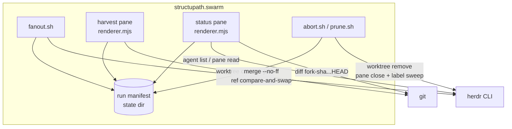
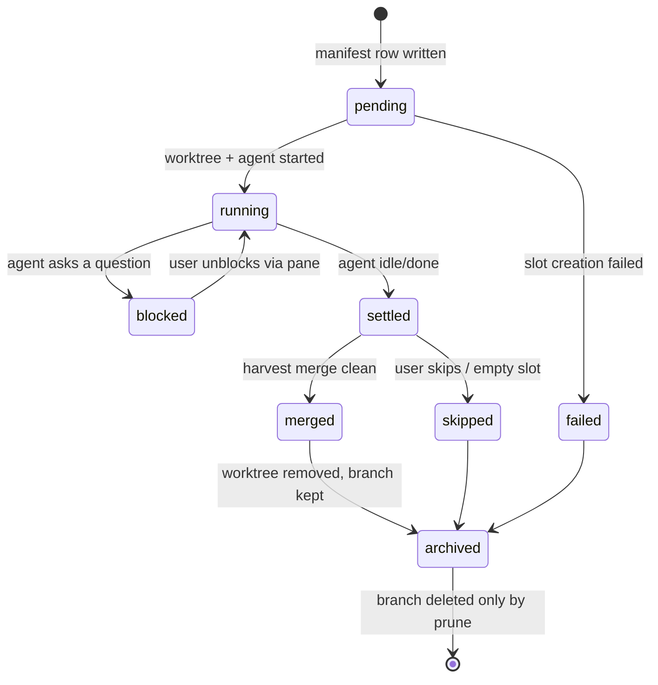
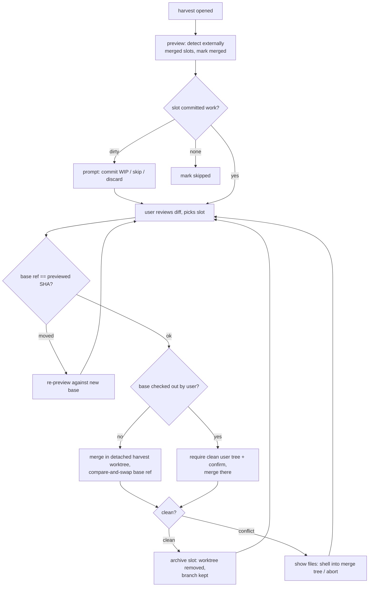

# feat: herdr-swarm — worktree-per-agent fan-out, diff, and harvest plugin

## Summary

A new Herdr plugin (id `structupath.swarm`, sibling to `structupath.browser`) that makes parallel coding agents safe on one repo: fan out N agents each into its own git worktree, watch what each one *changes* (not just what it prints), and harvest the work back to the base branch through a review-first merge flow. Built on Herdr 0.7.4's `worktree` and `agent` primitives plus plain git for diff and merge.

---

## Problem Frame

Herdr's unit is a pane — a PTY. Panes share the working tree, so three coding agents on one repo stomp each other's edits. Herdr nailed observability (agent states, pane management, sidebar) and, as of 0.7.x, ships the raw isolation primitives (`worktree create` auto-opens a grouped workspace; `agent start --cwd` spawns an agent anywhere). What no one ships — core roadmap checked, clear — is the workflow that makes those primitives a safe parallel-agent loop: one-command fan-out, per-agent change visibility, and merge-back. Every surveyed worktree-per-agent tool (Claude Squad, Crystal, Conductor, vibe-kanban, Sculptor, Claude Code native) confirms the same two hard parts: the harvest/merge half and the cleanup half. This plugin builds exactly those two halves on top of Herdr.

---

## Requirements

**Fan-out**

- R1. One action spawns N agents from a repo workspace, each in its own worktree on a run-unique branch forked from a recorded base SHA.
- R2. Fan-out is agent-agnostic: each slot runs arbitrary argv (claude, codex, …), selectable from user-defined presets.
- R3. Preflight refuses bad states loudly before creating anything: not a git repo, detached HEAD (prompts for base), leftover swarm branches/worktrees from prior runs, missing agent binaries, submodules present, an already-active run in this repo, unsupported Herdr version.
- R4. A slot failing mid-fan-out does not unwind successful slots; failures are marked in the run manifest and reported in a summary line.

**Visibility**

- R5. A status pane shows, per slot: agent state (with `blocked` visually loud and a jump-to-pane affordance), branch, and committed vs uncommitted change counts measured against the recorded fork SHA (`git diff <fork-sha>...HEAD`), never against the moving base tip.
- R6. Watch and harvest survive a Herdr restart: the run manifest reconciles against live Herdr state on every render; unqueryable agents display as `unknown`, and committed work stays harvestable.

**Harvest**

- R7. Harvest is review-first: the user sees each slot's diff and chooses merge order; merges are `--no-ff` with a templated message; the base ref is re-checked for drift before *every* merge, not once per harvest.
- R8. Merge failures surface as a staged flow — conflicts, hook failures, and refusals are classified and messaged distinctly, with a shell into the merge tree or abort offered — and every interrupted merge is *recoverable*: the base ref never silently moves, and any residual state (`MERGE_HEAD`, dangling merge commit) is detected and surfaced on the next harvest or abort.
- R9. Uncommitted work in a slot at harvest prompts commit-as-WIP / skip / discard; nothing is silently lost or silently included.
- R10. Worktree teardown is decoupled from branch deletion: harvest archives (removes worktree, keeps branch); branch deletion is a separate explicit prune action limited to fully-merged `swarm/*` branches.

**Cleanup**

- R11. Abort and cleanup reap only resources the plugin created (manifest-tracked, label-matched), never `--force` by default, and always print a summary of what was closed/removed/kept.
- R12. No timed background garbage collection anywhere; all teardown is an explicit user action.

**Compatibility**

- R13. `min_herdr_version = "0.7.4"`; all CLI calls use the 0.7.4/0.7.5 intersection where one exists (`agent wait`, not `herdr wait`); fan-out runs on 0.7.4 and on 0.7.5+ via two paths behind one gated function *(revised 2026-07-22, issue #1 — originally "hard-refuses … where `agent start --cwd/--workspace` is absent")*, and hard-refuses only below the 0.7.4 floor, where neither path exists. Harvest and cleanup of an existing run work on every version (they are mostly git).

---

## Key Technical Decisions

- **Build on Herdr's worktree/agent primitives; use plain git only where Herdr has nothing.** `herdr worktree create --json` (auto-opens the grouped workspace, returns real paths — never hard-code the `~/.herdr/worktrees` convention; upstream #261 plans to change it) and `herdr agent start` do topology. Diff and merge are pure git — core has no such surface and none is roadmapped.
- **Merge locus: never silently mutate the user's checkout.** When the base branch is not checked out anywhere, merge in a plugin-owned harvest worktree created with plain `git worktree add --detach` (never `herdr worktree create`, which mints branches and opens workspaces), manifest-tracked so abort can reap it — then advance the base ref. When base *is* the user's checked-out branch (the common case — git forbids a second checkout), merge in the user's tree only after verifying it is clean and getting an explicit confirm, re-verifying clean-tree and base SHA again immediately after the confirm (the prompt can sit for minutes). Alternatives rejected: always merging in the user's tree (the top clobber risk flow analysis identified); checking base out non-detached in the harvest worktree (closes the checkout race but a crashed or conflict-stalled harvest leaves the user's branch "checked out at ~/.herdr/…" — branch held hostage beats harvest refused, so detached wins).
- **The atomic ref update is the guarantee in the detached locus; the user-tree locus gets post-merge verification.** In the detached harvest worktree, the base ref advances only via three-arg `git update-ref <ref> <new> <expected-old>` — the atomic compare-and-swap — with a reflog message (`swarm: harvest merge <slot> (run <run-id>)`) as the recovery breadcrumb; the pre-merge drift check merely triggers re-preview, and a check-then-plain-write implementation has exactly the clobber window this design exists to prevent. In the in-user-tree locus no expected-old form exists — `git merge` advances the ref through HEAD — so the guard there is post-merge: assert the new merge commit's first parent equals the expected base SHA, recovering via `git reset --hard ORIG_HEAD` with a loud message on mismatch. All ref operations use fully-qualified `refs/heads/<base>`; a symref base is refused at preflight. Immediately before the update, re-scan `git worktree list --porcelain` for a base checkout (the L-test can go stale; residual millisecond window documented, not denied). Harvest refuses while any worktree has sequencer state in flight — `rebase-merge/`, `rebase-apply/`, `CHERRY_PICK_HEAD`, `MERGE_HEAD`, `BISECT_LOG` — because a finishing rebase moves the base ref without an expected-old check and would silently discard a mid-rebase harvest merge.
- **Hook policy is explicit, not accidental.** Merges run repo hooks by default in both loci. In the harvest worktree, hooks that shell into `node_modules/.bin` fail because fresh worktrees lack deps — the failure message names that likely cause and offers a shell; a config flag can disable hooks in the plugin-owned worktree only. Hooks are never silently suppressed in the user's tree. Merge failures are classified conflict / hook-or-other failure / refusal, all recoverable via `git merge --abort`.
- **Snapshot before discard.** Any discard of uncommitted work first writes the dirty tree — tracked and untracked — to a plugin-owned backup ref (`refs/swarm-backups/<run-id>/<slot>`), records the SHA in the manifest, and prints it; the ref write precedes any destructive checkout/clean. Backup refs are listed and deleted only by the explicit prune action (no timed GC, per R12). Ignored files are outside even this net — see the ignored-files risk.
- **Merge, not rebase; `--no-ff` with a templated message.** Crystal shipped rebase-first and reversed to merge "for safer operations" in production. Message shape `swarm: merge <slot-label> (run <run-id>)` keeps harvests auditable in `git log`. Rebase is not offered in v1.
- **The run manifest is the backbone artifact, written ahead of every mutation.** One JSON file per run in `HERDR_PLUGIN_STATE_DIR`: run id, repo path, base ref + fork-point SHA, and per slot {branch, worktree path, workspace id, agent name, pane ids, selfCreated tag, status: pending/running/failed/settled/merged/skipped/archived, backup-ref SHA when present}. Writes are fsync-then-atomic-rename with the previous generation kept as `.bak`; the manifest stays a superset of git/Herdr reality at all times (write the `pending` row before creating, record returned paths before starting agents) so abort can over-approximate and verify, never guess. Destructive verbs journal their intent (slot, locus, expected base SHA, merge-commit SHA the moment it exists) before invoking git, so a crash inside the merge critical section is detected and resumable on the next open. Writers are launchers and harvest verbs only, serialized by the mutation lock; the status renderer reconciles in memory for display and never writes.
- **Run-unique naming defeats stale-run resurrection.** Branches are `swarm/<run-id>/<slot-slug>` where run-id contains a timestamp+nonce. `worktree create` reuses an existing branch silently (0.7.1 behavior) — with reused names, a new agent would start from last run's half-finished code. Preflight additionally runs `git worktree prune` and surfaces any leftover `swarm/*` detritus before creating anything.
- **Input channel: config presets + a fan-out pane + a task file per worktree.** Plugin actions receive zero argv and have no TTY (spike-confirmed; the sibling's actions never prompt) — so `fanout.sh` is a thin opener and a dedicated fan-out pane owns the prompting, the mutation lock, and the create/start loop. Slot presets (name → argv) live in a config-dir file. The pane collects N/preset choices and a shared task prompt, then optional per-slot overrides (one extra prompt loop — divergent tasks are the framing use case; shared prompt is the best-of-N default). Each slot's prompt is written to a fixed well-known task file (`.swarm-task.md`) in that worktree; presets reference that filename by convention — no placeholder-substitution machinery. The file ends with a standing footer instructing the agent to commit completed work locally and never push (the parallel-fix convention). Exclusion: the exclude file is shared repo-wide and `.git` is a file in linked worktrees, so resolve it via `git rev-parse --git-path info/exclude`, append one namespaced `.swarm-task.md` pattern once per repo, record the addition in the manifest, and remove it at cleanup.
- **Version strategy: floor at 0.7.4, write to the intersection, carry two topology paths behind one seam.** *(Revised 2026-07-22 when issue #1 landed; the original wording — "pin 0.7.4 … on 0.7.5 fan-out refuses" — is superseded. The seam design it predicted held exactly.)* 0.7.5 removed `herdr wait`, renamed `agent send`, made plugins global per-user, and replaced `agent start --cwd/--workspace` with a pane-targeting form. Only the `agent start` call has no intersection form, so it is isolated in one lib function, `herdr_agent_start` — and that function now carries BOTH paths: `agent start --cwd` on 0.7.4, and `pane split --cwd` + `pane run` + `pane report-agent` on 0.7.5+, normalized to one output contract so no call site knows which ran. The 0.7.5 `--kind` whitelist is closed and has no arbitrary-argv member (live-verified, `spike-out/l-075-verified.txt`), which is *why* the plugin builds slot topology itself there rather than dispatching on kind. Cost of that route, accepted: slot agent state is plugin-reported rather than natively detected on 0.7.5+ (`working` at start, `idle` at harvest preview — no daemon, no poller), documented in the README. The version gate is therefore a floor, not a pin: below 0.7.4 neither path exists and fan-out refuses. No `[[startup]]` hooks (0.7.5-only). Enforced as an invariant, not an aspiration: every Herdr invocation goes through a named wrapper in `scripts/lib.sh` (renderer calls confined to one module section), with a test asserting no raw `herdr ` invocations outside the wrappers. Versions above the max tested get a warning, never a refusal. Revisit trigger for a real adapter layer: a future release breaking two or more *intersection* calls; until then a formal adapter is KISS-violating machinery.
- **House architecture, copied from herdr-browser wholesale.** Thin bash launchers (one per action) + one zero-dep Node renderer per pane; `scripts/lib.sh` carries `state_dir()`, sanitized `ws_id()`, `with_timeout()`, `parse_pane_id()`, preflights, and the `mkdir`+PID-token lock; `split` placement only (popups are singleton with no pane id); state-dir files are the only cross-process channel (pane env is spawn-time-only); `platforms = ["macos", "linux"]`; hyphenated action ids (Herdr rejects dots); stub-CLI `node --test` harness. Every non-obvious line carries a *why* comment naming the failure mode it prevents.
- **Ownership before destruction.** Every created resource is tagged in the manifest at creation; abort/cleanup removes only tagged resources, uses `git worktree remove` without `--force` (dirty state fails noisily into the R9 prompt), and pane sweeps match only this plugin's manifest pane titles. Anything that becomes a filesystem path (run id, slot slug, branch) is charset-restricted at the edge with the bash/JS-lockstep discipline, since worktree removal is an `rm -rf`-class operation.
- **Destructive git lives in `scripts/` only; one mutation lock.** The harvest pane deviates from the sibling's passive-viewer rule — justified, because a multi-step review flow has no home in one-shot zero-argv actions — but the deviation is contained: the renderer is UI, state machine, and orchestration; every state-mutating git/herdr command lives in bash verb scripts invoked by the renderer. That keeps all `rm -rf`-class and ref-mutating code under the stub-CLI test harness in one language, and makes "no `git merge`/`update-ref` strings in `bin/`" a grep-able audit invariant. Fan-out, harvest merges, abort, and prune all contend on one per-repo mutation lock, so an abort can never reap a worktree mid-merge; the renderer masks SIGINT while a destructive verb is in flight.

---

## High-Level Technical Design

Directional guidance, not implementation specification.

**Components**



**Slot lifecycle**



**Harvest loop** (per-merge drift re-check is the load-bearing detail — a one-shot "review then merge all" reading is wrong)



---

## Output Structure

Scope declaration, not a constraint; per-unit Files lists are authoritative.

```
herdr-plugin.toml          # id structupath.swarm, actions, panes
package.json               # zero deps, node --test, engines >=20
bin/renderer.mjs           # status + harvest pane renderer (mode via spawn-time env)
scripts/
  lib.sh                   # shared helpers (state dir, locks, sanitize, version gate)
  preflight.sh             # shared preflight checks
  fanout.sh  status.sh  harvest.sh  abort.sh  prune.sh
  fanout-pane.sh  status-pane.sh  harvest-pane.sh
tests/
  lib.test.mjs  fanout.test.mjs  harvest.test.mjs  cleanup.test.mjs  renderer.test.mjs
docs/plans/                # this plan
spike-out/                 # gitignored empirical evidence (U1)
```

---

## Implementation Units

### U1. Environment spike

- **Goal:** Settle the undocumented Herdr facts that gate lifecycle design, with evidence kept on disk (the herdr-browser spike caught non-idempotent `pane open` this way).
- **Requirements:** R6, R11, R13
- **Dependencies:** none
- **Files:** `spike-out/*.txt` (gitignored), throwaway scripts under `spike-out/`
- **Approach:** Answer empirically against the installed Herdr: (a) how a live agent is stopped, and what `worktree remove --workspace` does to a workspace with a live agent (fail / orphan / kill); (b) what closing the parent repo workspace does to grouped worktree workspaces and their agents; (c) whether agents survive a Herdr server restart and what `agent list` reports after; (d) `worktree create` behavior when the target path or branch already exists; (e) the `[[events]]` catalog via `herdr api schema` (docs show only `worktree.created`); (f) exact `HERDR_PLUGIN_CONTEXT_JSON` shape inside a worktree-grouped workspace; (g) whether `pane report-metadata` tokens render in sidebar rows usefully for per-slot status; (h) whether `git worktree remove` without `--force` succeeds when only ignored/excluded files are present, on the installed git — the archive path and the task-file design both depend on it; (i) whether `HERDR_PLUGIN_STATE_DIR` resolves to the same path under 0.7.5's global-per-user plugin model and whether a 0.7.4-written manifest is discoverable after upgrade; (j) the exact 0.7.5 pane-targeting `agent start` CLI shape and whether a pane-based fan-out start is a contained variant of the gated function (build it this run if cheap, defer with the marketplace gate documented if not); (k) whether `agent start` output carries the pane/terminal ids the manifest needs, or correlation via `agent list` is required.
- **Test scenarios:** Test expectation: none — spike; evidence files are the deliverable.
- **Verification:** Each question above has a dated answer recorded in `spike-out/`; design-affecting surprises are folded back into this plan before U4/U6 start.

### U2. Repo scaffold, manifest, and shared lib

- **Goal:** A linkable plugin skeleton with the house helper layer and test harness in place.
- **Requirements:** R13
- **Dependencies:** none
- **Files:** `herdr-plugin.toml`, `package.json`, `.gitignore`, `LICENSE`, `scripts/lib.sh`, `tests/lib.test.mjs`
- **Approach:** Copy the herdr-browser skeleton: manifest header (`id = "structupath.swarm"`, `min_herdr_version = "0.7.4"`, `platforms = ["macos","linux"]`), action/pane blocks with hyphenated ids and static argv where one script serves variants; `lib.sh` with `state_dir()`, `ws_id()`, `with_timeout()`, `parse_pane_id()`, `pane_alive()`, `require_herdr`, the `mkdir`+PID-token lock, plus new `herdr_version()`/`version_gate()` and `sanitize_slug()` helpers; stub-CLI test harness (`writeStub`/`freshEnv`/`runScript`) with a stub `herdr` mirroring real 0.7.4 JSON for `worktree create`, `pane list`, `agent list`.
- **Patterns to follow:** Sibling repo herdr-browser: `scripts/lib.sh`, `tests/launchers.test.mjs` harness helpers, manifest shape.
- **Test scenarios:** `sanitize_slug` strips path-dangerous chars (bash and JS lockstep-asserted); `state_dir` rejects relative paths and expands literal `~`; `parse_pane_id` handles compact and pretty-printed JSON; `with_timeout` kills a hung child (exit 137); `version_gate` accepts 0.7.4 and 0.7.5 for gated calls, refuses below the 0.7.4 floor, warns above the max tested, and passes intersection calls through *(revised 2026-07-22, issue #1 — it originally refused 0.7.5)*.
- **Verification:** `herdr plugin link` accepts the repo; `npm test` green.

### U3. Run manifest and preflight

- **Goal:** The manifest read/write layer and the fan-out preflight that refuses every known bad state before anything is created.
- **Requirements:** R1, R3, R6
- **Dependencies:** U1, U2
- **Files:** `scripts/preflight.sh`, manifest helpers in `scripts/lib.sh` and `bin/renderer.mjs`, `tests/lib.test.mjs`
- **Approach:** Manifest schema per the KTD (one JSON file per run, per-slot rows with fork SHA and selfCreated tags); writes are fsync-then-atomic-rename, previous generation kept as `.bak`. Readers treat a corrupt manifest as a first-class state: destructive callers refuse and degrade to report-only discovery (`git worktree list` + `swarm/*` branch pattern + pane-title sweep). Preflight checks, each with an actionable refusal message: git repo present; base ref resolved (current branch; prompt if detached; refuse unborn HEAD and symref base); `git worktree prune` then leftover `swarm/*` branch/worktree detection with a surface-and-choose prompt; `command -v` for every slot's argv before any worktree is created; `.gitmodules` present → refuse (submodules unsupported v1); sparse-checkout detected → in-user-tree merges refused later, noted at fan-out; active-run lock per repo; version gate; soft slot cap (default 6, config-overridable).
- **Test scenarios:** Preflight refuses each bad state with distinct messaging (table-driven against stub git/herdr); manifest round-trips and survives a partial write (temp-file rename); zero-length manifest → readers report corrupt and destructive callers refuse; truncated JSON → report-only fallback lists live swarm worktrees; `.bak` recovery round-trip; leftover `swarm/*` branch triggers the detritus prompt; slot 3 argv missing → refusal happens before any `worktree create` call appears in the stub log.
- **Verification:** All refusal paths observable in stub logs; `npm test` green.

### U4. Fan-out action

- **Goal:** One action takes a repo workspace to N running agents, each in its own worktree, with the run manifest written and the status pane opened.
- **Requirements:** R1, R2, R4, R13
- **Dependencies:** U3
- **Files:** `scripts/fanout.sh` (thin action: opens the fan-out pane), `scripts/fanout-pane.sh` (+ its `[[panes]]` manifest entry), slot-preset config file handling in `scripts/lib.sh`, `tests/fanout.test.mjs`
- **Approach:** The fan-out pane collects input per the KTD (presets, N, shared prompt, optional per-slot overrides), then writes each slot's task file and runs the loop. Per-slot ordering is pinned write-ahead: write `pending` row (branch known, path null) → `worktree create --json` → record returned path → version-gated `agent start` → row `running`, atomic rename on each update — the manifest is always a superset of reality. On slot failure keep earlier slots, mark `failed`, continue, and print a summary line; hold the mutation lock for the whole fan-out; open the status pane last. Spike-settled details: always pass `--cwd` explicitly to `agent start` (`--workspace` alone does not inherit the workspace cwd — spike (k)); the start JSON carries pane/terminal/workspace ids, so manifest rows are written straight from it; presets are shaped `{kind, args}` for 0.7.5 forward-compat even though v1 runs argv. *(Revised 2026-07-22, issue #1: the 0.7.5 pane-based start is no longer deferred — it SHIPPED. Spike (j) was right that `--kind` has no arbitrary-argv path, and live verification (l) confirmed it, so `kind` stayed inert; the contained variant that satisfies R2 turned out to be building the topology directly — `pane split --cwd` + `pane run` + `pane report-agent` — inside `herdr_agent_start`. The loop passes `--split-from <root pane id>` so that path has an anchor to split; the 0.7.4 branch drops the flag.)*
- **Test scenarios:** N=3 → exactly 3 `worktree create` + 3 `agent start` in stub log with distinct run-unique branches, manifest row writes interleaved write-ahead (log-order assertion); slot 2 `worktree create` fails → slots 1 and 3 running, manifest shows `failed`, summary line printed; kill between `worktree create` returning and path recording → `pending`-null-path row remains and U7's branch-name reconciliation finds the worktree; concurrent double-invoke → exactly one fan-out proceeds (lock); active run present → refused with "harvest or abort first"; task file exists in each worktree and is excluded from `git status` output; on stub 0.7.5 `agent start` → fan-out refuses, nothing created.
- **Verification:** Live smoke: fan-out of 2 echo-agents in a scratch repo produces 2 grouped workspaces, 2 branches, a manifest, and a status pane.

### U5. Status pane

- **Goal:** Live per-slot visibility: agent state, branch, committed vs uncommitted counts against the fork SHA.
- **Requirements:** R5, R6
- **Dependencies:** U3 (manifest); U4 for live use
- **Files:** `bin/renderer.mjs`, `scripts/status.sh`, `scripts/status-pane.sh`, `tests/renderer.test.mjs`
- **Execution note:** Build the state-reconciliation helpers (manifest × live `agent list` → displayed state) test-first; they encode R6's restart-survival contract.
- **Approach:** Zero-dep renderer polling manifest + `git diff --stat <fork-sha>...HEAD` + `git status --porcelain` per worktree and `herdr agent list`, with herdr-browser's adaptive poll backoff; strictly read-only — reconciliation results render in memory and are never written back (single-writer rule). `blocked` rendered loud with a jump-to-pane key (`herdr agent focus <target>`, `herdr workspace focus` as fallback — agent terminals are not plugin panes, so plugin-scoped focus can't reach them; directional focus can't target ids); unqueryable agents shown `unknown`, never stuck `working`; a slot whose worktree or branch was deleted out from under the run renders `missing` instead of crashing the pane; a slot whose workspace vanished (closing the parent repo workspace cascades, killing swarm agents silently — spike (b)) renders `unknown` with its committed work still shown harvestable; `sanitizeText` on branch names, commit subjects, and agent excerpts; optionally publish per-slot `report-metadata` sidebar tokens if the U1 spike shows they render usefully; crash path lingers 10 minutes after restoring the terminal.
- **Patterns to follow:** Sibling herdr-browser `bin/renderer.mjs`: pure exported helpers, `pollDelay`, `sanitizeText`, main-module guard for importability.
- **Test scenarios:** Diff counts use `fork-sha...HEAD` (stub git asserts the exact range form — base-tip forms are the known inflation bug); slot with commits + dirty tree shows both numbers; manifest says `running` but agent missing from `agent list` → renders `unknown`; worktree dir deleted → renders `missing`, pane keeps rendering other slots; renderer performs zero manifest writes across a full poll cycle (stub filesystem assertion); blocked slot sorts/marks loud; pollDelay backs off and clamps; sanitizeText strips C0/C1/bidi from a hostile branch name.
- **Verification:** Against a live 2-slot run: states track agent activity; counts change only when the worktree changes, including after base advances.

### U6. Harvest

- **Goal:** Review-first merge-back with the drift guard, staged conflict handling, and the uncommitted-work prompt.
- **Requirements:** R7, R8, R9, R10
- **Dependencies:** U5; U1 answers (a)–(c) gate the agent-stop step in archive
- **Files:** `scripts/harvest.sh`, `scripts/harvest-pane.sh`, harvest mode in `bin/renderer.mjs`, `tests/harvest.test.mjs`
- **Execution note:** Implement the merge-locus decision and drift compare-and-swap test-first against a stub git; these are the destructive-path guards.
- **Approach:** Interactive pane lists slots with diff summaries; the renderer orchestrates but every mutating step is a bash verb script under the mutation lock (destructive-surface KTD). Preview detects a slot tip already ancestor-of-base (user merged it themselves) and auto-marks it merged rather than re-merging into "Already up to date". Per selected slot: uncommitted-work prompt (commit-WIP / skip / discard, discard preceded by the backup-ref snapshot) → sequencer-state and drift checks → merge per the merge-locus KTD, journaled in the manifest before git runs → clean: archive slot — verify the slot is settled (never archive a `working` agent; spike (a) showed the herdr remove verb silently kills live agents), show the ignored-file inventory (ignored files are the one class removal deletes silently — spike (h) confirmed on git 2.55; the plugin's task file is excluded from the inventory), then remove via the herdr verb, which stops the agent, closes the grouped workspace, and removes the worktree in one shot — detecting dirty refusal by the machine-readable `dirty_worktree_requires_force` error code, never message parsing; branch kept, manifest updated; conflict or hook failure: classify, list files, offer shell-into-merge-tree (PTY handoff with terminal restore) or abort. After every merge, remaining previews re-baseline. `--no-ff` with the templated message. The refusal messages for the in-user-tree path name the escape hatch: check out any other branch and re-run harvest, which converts the hard case into the safe detached case.
- **Test scenarios:** Clean merge in the detached locus advances base via three-arg `update-ref` and archives the slot (branch still exists); archive with a live idle agent stops the agent and closes its workspace before the worktree is removed; in-user-tree merge is followed by the first-parent verification, and a mismatch triggers `reset --hard ORIG_HEAD` with a loud message; base moves *between* the drift check and the ref write → the swap itself fails, base unchanged (interleaved stub); base moved between preview and merge → refused, re-preview offered; sequencer state present in any worktree (`rebase-merge/`, `MERGE_HEAD`, …) → harvest refuses; conflict in harvest worktree → base ref unchanged, user checkout untouched, worktree left for inspection or cleanly aborted; hook failure classified distinctly from conflict, `merge --abort` recovers; base checked out + dirty user tree → refused before any git mutation; post-confirm re-verify catches a tree dirtied while the prompt sat; externally ff-merged slot shows as merged, not pending; discard writes the backup ref before the tree is touched (stub log ordering) and the work is recoverable from it; archive with an agent-created ignored file present → inventory prompt names the file; task file alone → no prompt; kill between merge-commit creation and ref update → reopen detects the journal, offers completing the swap when base is unmoved and reports the dangling SHA when it moved; empty slot auto-skips; merge message matches the template; second merge in one harvest re-checks drift (two ref reads in stub log); shell-into-merge-tree restores terminal state on exit, including when the merge is still conflicted.
- **Verification:** Live: two-slot run where slot A merges clean and slot B conflicts; after harvest, `git log --graph` shows one `--no-ff` merge, base ref correct, user checkout bit-identical to pre-harvest apart from the merge.

### U7. Abort, cleanup, and prune

- **Goal:** Abandon a run (mid-flight or post-crash) leaving nothing orphaned, and prune merged branches on demand.
- **Requirements:** R10, R11, R12
- **Dependencies:** U3; U1 answers (a)–(c) gate the stop mechanism
- **Files:** `scripts/abort.sh`, `scripts/prune.sh`, `tests/cleanup.test.mjs`
- **Approach:** Abort contends on the mutation lock, then walks the manifest: stop each agent (mechanism per U1 spike; fallback close-pane-and-verify via `agent wait`), close tracked panes unconditionally plus a label sweep scoped to this workspace and this plugin's pane titles (generic `pane close`, not plugin-scoped — the plugin-scoped variant no-ops across re-registrations), `worktree remove` per slot without `--force` (dirty → R9 prompt), reap `failed`-slot worktrees and the harvest worktree (unless its journal shows an un-swapped merge commit — then report, never delete), reconcile `pending`-null-path rows against `git worktree list` by run-unique branch name, sweep `swarm/*` branches even for slots whose create errored (spike (d): a failed create can leak its new branch with no rollback), fall back to `git worktree prune` for gone paths ("already gone" in summary), detect leftover `MERGE_HEAD` in the user's tree and offer `merge --abort`, archive the manifest (never delete — it is the recovery record), release the lock, print a summary of closed/removed/kept. On a corrupt manifest, abort refuses destructive operations and reports what it *would* reap via discovery (U3 fallback). Prune is a separate action whose merged check is an explicit ancestry test against the manifest-recorded base branch — never `git branch -d`'s HEAD-relative semantics, never manifest status alone — with a dry-run listing first that also lists backup refs and flags merged-then-reverted branches (deletion requires acknowledging the flag).
- **Test scenarios:** Abort closes only manifest-tracked + label-matched panes (a decoy user pane survives); dirty worktree → kept, prompted, reported in summary; abort after simulated crash (manifest present, agents gone) completes and reports; abort with a `pending`-null-path row finds the worktree by branch name and reaps it; harvest worktree holding an un-swapped merge commit → reported, not deleted; corrupt manifest → report-only, nothing destroyed; manually deleted worktree path → `worktree prune` fallback, "already gone" reported; `MERGE_HEAD` in user tree → detected, `merge --abort` offered; prune with a non-base branch checked out still evaluates ancestry against the recorded base; base hard-reset before the merge → branch reported unmerged and kept; merge-then-revert → flagged, delete needs acknowledgment; unmerged branch survives `-d`; foreign branches and worktrees never listed or touched; backup refs listed and deleted only on explicit selection; summary line always printed.
- **Verification:** Live: abort a 2-slot run mid-flight → `git worktree list` and `herdr pane list` show nothing swarm-owned; branches remain until prune.

### U8. README and marketplace listing

- **Goal:** Installable, discoverable, honestly documented.
- **Requirements:** R2, R3 (documented caveats)
- **Dependencies:** U4–U7
- **Files:** `README.md`, repo topic `herdr-plugin` on the public `StructuPath/herdr-swarm` repo
- **Approach:** Install (`herdr plugin install StructuPath/herdr-swarm`), quick-start, slot-preset config format, a suggested `[[keys.command]]` snippet (plugins cannot ship default keybindings), the fresh-worktree caveat (gitignored `.env`/`node_modules`/deps are absent in new worktrees — document it and the optional per-repo `setup.sh` config hook run in each new worktree), and the squash-merge sharp edge (a slot the user squash-merged themselves still shows pending and will conflict on re-merge — documented, not detected in v1). **Marketplace sequencing:** *(revised 2026-07-22, issue #1)* the blocker is cleared — fan-out runs on current stable, so no fresh installer meets a version refusal at the entry point. Whether to push the `herdr-plugin` topic is now an open decision on its own merits, not a consequence of this work. The README also gained the 0.7.5 state-reporting degradation (plugin-reported `working`/`idle` vs herdr's native detection on 0.7.4) and the `pane run` shell-interpretation caveat.
- **Test scenarios:** Test expectation: none — documentation; config-example lint covered by U3 tests.
- **Verification:** Fresh-machine dry read: a user can go install → fan-out → harvest without reading source; marketplace listing appears (~30 min after topic push).

---

## Scope Boundaries

### Deferred to follow-up work

- Agent-assisted conflict resolution (spawn a resolver agent on conflicted files — vibe-kanban's pattern; v1 stops at shell-into-merge-tree).
- 0.7.5+ pane-based `agent start` path (v1 refuses fan-out there; harvest/cleanup still work). **Gates the marketplace listing** — see U8.
- Squash-merge detection (an externally squash-merged slot shows pending; ff/plain external merges are auto-detected via the ancestry check, squash stays a documented sharp edge).
- PR-based harvest (push branch + open PR instead of local merge).
- Multiple concurrent runs per repo (v1: one active run, refuse otherwise).
- Submodule support (v1 detects and refuses).
- Sidebar metadata tokens if the U1 spike shows they don't render usefully.

### Outside this plugin's identity

- Not a general git UI — no staging, no history browsing, no rebase workflows.
- No container isolation (worktrees only; Sculptor's territory).
- No upstreaming into Herdr core; no timed background GC ever (both failure modes — never fires, fires mid-write — are documented in the field).

---

## Risks & Dependencies

- **Herdr CLI churn is the top risk.** 0.7.4→0.7.5 broke four surfaces in one week. Mitigation: intersection-safe calls, the single version-gated function, all Herdr invocations localized in `lib.sh` + one renderer module, tested against a stub that mirrors real JSON.
- **Merge-back is destructive by nature.** Mitigations are structural (KTDs): compare-and-swap on the base ref, clean-tree + confirm before touching the user's checkout, no-`--force` removal, ownership tags, typed confirmation for discard.
- **Fresh worktrees lack env/deps** — the most likely "all my agents failed instantly" report. Mitigated by documentation + optional `setup.sh` hook (U8); not silently fixed.
- **Upstream `[worktrees].directory` layout change is planned** (herdr #261) — paths are always read from `--json` responses, never derived.
- **Herdr relicensing AGPL→Apache in progress** — no code linkage (shell-out only), no obligation either way.
- **Agent-state detection varies by integration** (lifecycle-authority vs screen-detected agents) — status pane treats states as advisory, never gates harvest on them alone (committed work is harvestable regardless of reported state).
- **Ignored files sit outside every safety net** — not blocked by no-`--force` removal, not captured by WIP commits or backup snapshots. Mitigation: the archive-time ignored-file inventory prompt (U6) is the only guard; U1(h) verifies the underlying git behavior.
- **A crash inside the merge critical section leaves a dangling merge commit — by design.** The manifest journal records its SHA before the ref update; harvest-reopen and abort surface it (complete the swap, or report the SHA for manual recovery). It is never silently unreachable, and the harvest worktree holding it is never auto-deleted.
- **Prune trusts git ancestry, not bookkeeping.** Manifest status and `git branch -d`'s HEAD-relative check can both diverge from reality after user resets, rebases, or reverts; the ancestry-against-recorded-base rule (U7) is the single authority for deletion.
- **Fan-out refuses on the current latest stable (0.7.5)** — acceptable for personal use on 0.7.4, launch-blocking for the marketplace; sequencing handled in U8, compat path tracked in Scope Boundaries.

---

## Open Questions

None block planning; all are U1 spike questions whose answers refine U4/U6/U7 details: agent stop mechanism, parent-workspace close cascade, restart survival, `worktree create` collision behavior, the events catalog, context-JSON shape, sidebar token rendering, `worktree remove` behavior when only ignored/excluded files are present, state-dir survival across the 0.7.5 upgrade, the 0.7.5 pane-based start shape (build-if-cheap), and whether `agent start` returns pane ids.

---

## Sources & Research

- Sibling plugin (house pattern, all reusable helpers named above): `StructuPath/herdr-browser`, local `../herdr-browser` — `scripts/lib.sh`, `scripts/open.sh` (lock), `scripts/close.sh` (sweep), `tests/launchers.test.mjs` (stub harness), its plan doc for the U1-spike-first convention. Spike facts: zero argv to actions, non-idempotent `pane open`, pane-title-as-label sweep key, directional-only focus.
- Herdr docs and releases: plugin authoring (https://herdr.dev/docs/plugins/), CLI reference (https://herdr.dev/docs/cli-reference/), configuration `[worktrees]` (https://herdr.dev/docs/configuration/), integrations (https://herdr.dev/docs/integrations/), releases v0.7.0–v0.7.5 (https://github.com/ogulcancelik/herdr/releases), planned worktree-path change (https://github.com/ogulcancelik/herdr/issues/261). Core roadmap has no worktree diff/merge features (preview docs + open issues checked 2026-07-22).
- Merge-back prior art: Crystal's rebase→merge reversal (https://github.com/stravu/crystal/blob/main/CHANGELOG.md); Conductor's archive-decoupled-from-branch-deletion and merge-method transparency (https://www.conductor.build/docs/concepts/git-worktrees); vibe-kanban's staged conflict flow and cleanup complaints (#1764, #765, #306, discussion #2335); orphaned-worktree issue cluster on Claude Code native worktrees (#26725, #43730, #57767, #34645); gwq's granular cleanup CLI (https://github.com/d-kuro/gwq).
- In-house conventions: `parallel-fix` command in Flawless_Hub (agents commit never push; orchestrator merges; no-`--force` removal; never reuse slice identifiers) — the closest existing implementation of this loop.
- Local environment at planning time: herdr 0.7.4 installed; latest stable 0.7.5 (2026-07-21); herdr-browser linked as dev plugin.
